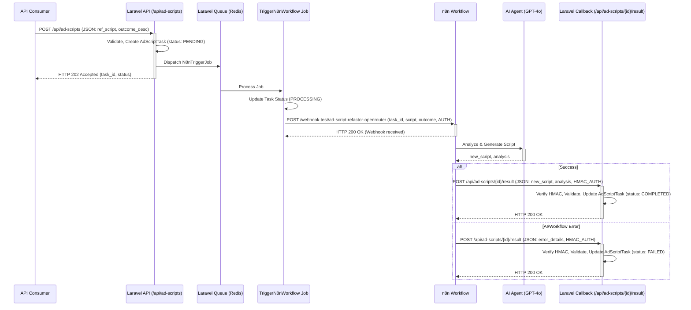

# Laravel n8n AI Ad Script Refactoring System

## Project Overview

This project integrates Laravel with n8n to provide an asynchronous API service for AI-powered ad script refactoring. It demonstrates a robust architecture for delegating AI processing tasks from a Laravel application to n8n workflows, ensuring proper error handling and idempotent operations.

## Architecture



## Setup & Run Instructions

### Prerequisites

- Docker and Docker Compose
- `make` (optional, for using Makefile targets)

### Installation

1. **Clone the repository**
   ```bash
   git clone <repository-url>
   cd laravel-n8n-ad-refactor
   ```

2. **Environment Setup**
   ```bash
   cp .env.example .env
   ```
   
   Edit `.env` and set the following required variables:
   - `APP_KEY` (generate using `php artisan key:generate`)
   - Database credentials (or keep defaults for Docker setup)
   - `N8N_TRIGGER_WEBHOOK_URL` (URL to n8n webhook)
   - `N8N_AUTH_HEADER_KEY` (header name for authenticating to n8n)
   - `N8N_AUTH_HEADER_VALUE` (secret value for authenticating to n8n)
   - `N8N_CALLBACK_HMAC_SECRET` (shared secret for verifying callbacks from n8n)

3. **Start the Services**
   ```bash
   make dev-setup
   ```
   Or manually with Docker:
   ```bash
   docker-compose up -d
   docker-compose exec app composer install
   docker-compose exec app php artisan migrate
   ```

4. **n8n Workflow Setup**
   - Access n8n at http://localhost:5678
   - Import the workflow from `n8n/workflows/ad-script-refactor-workflow.json`
   - Configure OpenAI credentials in n8n
   - Ensure the trigger webhook uses header authentication matching your `N8N_AUTH_HEADER_KEY` and `N8N_AUTH_HEADER_VALUE`
   - Ensure the callback HTTP request computes an HMAC signature using `N8N_CALLBACK_HMAC_SECRET`
   - For detailed n8n setup instructions, see [n8n/README.md](n8n/README.md)

### Default Ports

- Laravel: http://localhost:8000
- n8n: http://localhost:5678

## API Usage

### Create Ad Script Task

```bash
curl -X POST http://localhost:8000/api/ad-scripts \
  -H "Content-Type: application/json" \
  -d '{"reference_script": "function oldAd() { var count = 0; if(count == 0) { alert(\"First visit!\"); } }", "outcome_description": "Modernize to ES6+ with const/let and template literals"}'
```

Response (202 Accepted):
```json
{
  "data": {
    "id": "uuid-string",
    "status": "pending",
    "reference_script": "function oldAd() { var count = 0; if(count == 0) { alert(\"First visit!\"); } }",
    "outcome_description": "Modernize to ES6+ with const/let and template literals"
  }
}
```

### Check Task Status

```bash
curl -X GET http://localhost:8000/api/ad-scripts/{task_id}
```

Response (200 OK):
```json
{
  "data": {
    "id": "uuid-string",
    "status": "completed",
    "reference_script": "function oldAd() { var count = 0; if(count == 0) { alert(\"First visit!\"); } }",
    "outcome_description": "Modernize to ES6+ with const/let and template literals",
    "new_script": "function oldAd() { let count = 0; if(count === 0) { alert(`First visit!`); } }",
    "analysis": "Modernized using let instead of var, strict equality, and template literals."
  }
}
```

## Running Tests

```bash
make test
```

Or for test coverage:

```bash
make test-coverage
```

## Code Quality Tools

- **PHP CS Fixer**: `make cs-fix`
- **PHPStan**: `make analyse`
- **Husky Git Hooks**: Automatically validate commits

## Implementation Notes

### Key Features

- **Asynchronous Processing**: Tasks are processed in the background using Laravel queues
- **Idempotent Operations**: Callback endpoints are designed to handle duplicate requests
- **Error Handling**: Comprehensive error handling and reporting
- **Security**: HMAC signature verification for callbacks
- **Rate Limiting**: API endpoints are rate-limited to prevent abuse

### Design Philosophy

- **"5 Lines or Less"**: Methods are kept small and focused for readability
- **Interface-based Design**: Components are decoupled through interfaces
- **Defensive Programming**: Comprehensive validation and error handling
- **Test-Driven Development**: High test coverage for core functionality

## License

MIT

## API Testing with Postman & Newman

This project uses a programmatic Postman collection and Newman for automated API testing.

### Running API Tests Locally

1. Ensure your Laravel app is running at `http://localhost:8000`.
2. Install Newman globally if you haven't:
   ```bash
   yarn global add newman newman-reporter-htmlextra
   ```
3. Run the API tests:
   ```bash
   yarn test:api
   ```
   - This uses `postman/Ad_Script_Refactor_API.postman_collection.json` and `postman/local_dev.postman_environment.json`.
   - An HTML report will be generated at `postman/report.html`.

### Running API Tests in CI

- Use the `test:api:ci` script or run Newman directly with the CI environment file:
  ```bash
  yarn test:api:ci
  ```
  - This uses `postman/ci.postman_environment.json` (secrets should be injected at runtime).
  - A JUnit XML report will be generated at `postman/junit_report.xml`.

### Environment Files

- `postman/local_dev.postman_environment.json`: For local development/testing.
- `postman/ci.postman_environment.json`: For CI/CD pipelines (use secret injection for sensitive values).

### Adding/Editing API Tests

- Edit `postman/Ad_Script_Refactor_API.postman_collection.json` directly (code-first approach).
- See the [Postman Collection Format v2.1.0 docs](https://schema.getpostman.com/json/collection/v2.1.0/docs/index.html) for structure and scripting options.
