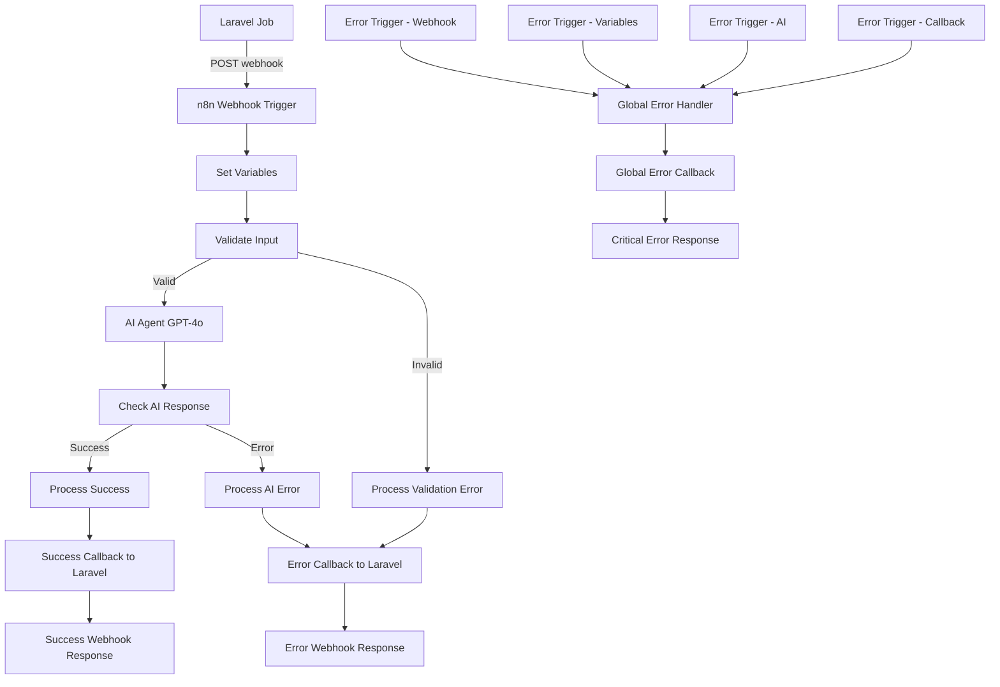

# n8n Workflow Configuration

This directory contains the n8n workflow configuration for the Laravel Ad Script Refactor system.

## Overview

The workflow processes ad script refactoring requests from Laravel using AI (GPT-4o) and sends results back via webhook callbacks. The enhanced workflow includes comprehensive error handling to ensure robust operation and proper error reporting.

## Workflow Components

### 1. Webhook Trigger
- **Path**: `/webhook-test/ad-script-refactor-openrouter`
- **Method**: POST
- **Authentication**: Header-based authentication using `X-Webhook-Secret`
- **Expected Payload**:
  ```json
  {
    "task_id": "uuid-string",
    "reference_script": "original JavaScript code",
    "outcome_description": "description of desired changes"
  }
  ```

### 2. Input Validation
- **Node**: `Validate Input`
- **Purpose**: Validates required fields (`task_id` and `reference_script`)
- **Error Handling**: Routes to validation error processor if fields are missing or empty

### 3. AI Processing
- **Model**: GPT-4o
- **Temperature**: 0.3 (for consistent results)
- **Max Tokens**: 2000
- **Timeout**: 60 seconds
- **Output Format**: Structured JSON with `new_script` and `analysis` fields

### 4. Comprehensive Error Handling
The workflow includes multiple layers of error handling:

#### Input Validation Layer
- Validates presence of required fields
- Handles missing or empty `task_id` and `reference_script`
- Routes to appropriate error processors

#### AI Processing Layer
- Handles API timeouts and failures
- Manages invalid credentials and rate limiting
- Processes malformed AI responses

#### Global Error Handling
- **Error Trigger Nodes**: Catch unexpected errors from any workflow node
- **Global Error Handler**: Processes all unhandled exceptions
- **Fallback Mechanisms**: Ensures all errors result in proper callbacks

#### Error Trigger Nodes
1. **Error Trigger - Webhook**: Catches webhook-related errors
2. **Error Trigger - Variables**: Catches variable processing errors
3. **Error Trigger - AI**: Catches AI processing errors
4. **Error Trigger - Callback**: Catches callback-related errors

### 5. Laravel Callbacks
- **Success**: `POST /api/ad-scripts/{task_id}/result` with refactored script and analysis
- **Error**: `POST /api/ad-scripts/{task_id}/result` with error details
- **Global Error**: Same endpoint with critical error information
- **Authentication**: Header-based authentication using `X-Webhook-Secret`
- **Retry Logic**: 3 attempts with 1-second intervals
- **Timeout**: 30 seconds per attempt

### 6. Response Handling
Different webhook responses based on outcome:
- **Success Response**: Confirms successful processing
- **Error Response**: Indicates handled error with callback sent
- **Critical Error Response**: Indicates critical error handled

## Setup Instructions

### 1. Import Workflow

1. Access your n8n instance at `http://localhost:5678`
2. Login with credentials (default: admin/admin123)
3. Go to **Workflows** → **Import from File**
4. Select `workflows/ad-script-refactor-workflow.json`
5. Click **Import**

### 2. Configure Credentials

#### OpenAI API Credentials
1. Go to **Credentials** → **Add Credential**
2. Select **OpenAI API**
3. Name: `OpenAI API`
4. API Key: Your OpenAI API key
5. Save

#### Laravel Webhook Authentication (Incoming)
1. Go to **Credentials** → **Add Credential**
2. Select **Header Auth**
3. Name: `Laravel Webhook Auth`
4. Header Name: `X-Webhook-Secret`
5. Header Value: Your webhook secret (from `N8N_WEBHOOK_SECRET` env var)
6. Save

#### Laravel Callback Authentication (Outgoing)
1. Go to **Credentials** → **Add Credential**
2. Select **Header Auth**
3. Name: `Laravel Callback Auth`
4. Header Name: `X-Webhook-Secret`
5. Header Value: Your callback secret (from `LARAVEL_CALLBACK_SECRET` env var)
6. Save

### 3. Environment Variables

Ensure these environment variables are set in your n8n instance:

```bash
# Laravel application URL for callbacks
LARAVEL_APP_URL=http://app:8000

# OpenAI API key for AI processing
OPENAI_API_KEY=your-openai-api-key-here
```

### 4. Activate Workflow

1. Open the imported workflow
2. Click **Active** toggle in the top-right corner
3. Verify the webhook URL is accessible

## Testing the Workflow

### Manual Testing with Postman

1. **Create a POST request** to:
   ```
   http://localhost:5678/webhook-test/ad-script-refactor-openrouter
   ```

2. **Add Headers**:
   ```
   Content-Type: application/json
   X-Webhook-Secret: your-webhook-secret-here
   ```

3. **Request Body**:
   ```json
   {
     "task_id": "test-123",
     "reference_script": "function oldFunction() { var x = 1; return x; }",
     "outcome_description": "Modernize to use const/let and arrow functions"
   }
   ```

4. **Expected Response**:
   ```json
   {
     "status": "success",
     "message": "Callback sent successfully",
     "task_id": "test-123"
   }
   ```

### Error Handling Testing

Use the provided test script to validate error handling:

```bash
# Install dependencies (if not already installed)
npm install axios

# Run comprehensive error handling tests
node test-error-handling.js
```

#### Test Scenarios Covered:
1. **Missing task_id validation**
2. **Missing reference_script validation**
3. **Empty required fields validation**
4. **Valid request processing**
5. **Large script processing**
6. **Invalid JSON handling**
7. **Authentication failure handling**

### Integration Testing

The workflow integrates with Laravel endpoints:

- **Trigger**: Laravel sends requests to n8n webhook
- **Callback**: n8n sends results to Laravel callback endpoint
- **Authentication**: Both directions use header-based authentication

## Workflow Flow



## Error Handling Details

### Error Types and Responses

1. **Input Validation Errors**
   - Missing or empty required fields
   - Response: Error callback with validation message

2. **AI Processing Errors**
   - API timeouts, invalid credentials, rate limiting
   - Response: Error callback with AI error details

3. **Response Processing Errors**
   - Malformed AI responses, parsing failures
   - Response: Error callback with parsing error

4. **Callback Errors**
   - Laravel endpoint unavailable, network issues
   - Response: Retry mechanism (3 attempts), then global error handler

5. **Critical Errors**
   - Unexpected workflow failures
   - Response: Global error callback with critical error details

### Error Monitoring

- **Execution Logs**: All errors logged with task IDs for traceability
- **Error Tracking**: Comprehensive error categorization and reporting
- **Callback Success Rates**: Monitor callback delivery success
- **Performance Metrics**: Track error rates and response times

## Troubleshooting

### Common Issues

1. **Webhook not receiving requests**
   - Check n8n is running and accessible
   - Verify webhook URL in Laravel configuration
   - Ensure authentication headers are correct

2. **AI processing fails**
   - Verify OpenAI API key is valid
   - Check API quota and rate limits
   - Review AI prompt and input format

3. **Callback failures**
   - Ensure Laravel application is accessible from n8n
   - Verify callback authentication credentials
   - Check Laravel logs for endpoint errors

4. **Input validation errors**
   - Verify required fields are present in webhook payload
   - Check field names match expected format
   - Ensure fields are not empty or null

### Debugging

1. **Check n8n execution logs**:
   - Go to **Executions** in n8n interface
   - Review failed executions for error details
   - Look for error trigger activations

2. **Monitor Laravel logs**:
   ```bash
   docker-compose logs -f app
   ```

3. **Test connectivity**:
   ```bash
   # From n8n container to Laravel
   curl -v http://app:8000/api/health
   
   # From Laravel container to n8n
   curl -v http://n8n:5678/webhook-test/ad-script-refactor-openrouter
   ```

4. **Run error handling tests**:
   ```bash
   # Test all error scenarios
   node n8n/test-error-handling.js
   
   # Check test results
   cat n8n/test-results.json
   ```

## Security Considerations

1. **Authentication**: All webhook communications use header-based authentication
2. **Secrets**: Store sensitive credentials securely in n8n credential store
3. **Network**: Containers communicate over internal Docker network
4. **Validation**: Input validation on both Laravel and n8n sides
5. **Error Information**: Error messages don't expose sensitive system details

## Monitoring

- **n8n Executions**: Monitor workflow execution success/failure rates
- **Error Rates**: Track different types of errors and their frequency
- **Laravel Logs**: Track job processing and callback handling
- **OpenAI Usage**: Monitor API usage and costs
- **Response Times**: Track end-to-end processing times
- **Callback Success**: Monitor callback delivery success rates

## Maintenance

1. **Regular Updates**: Keep n8n and node packages updated
2. **Credential Rotation**: Periodically rotate API keys and secrets
3. **Backup**: Export workflow configurations regularly
4. **Performance**: Monitor and optimize AI prompt efficiency
5. **Error Analysis**: Regularly review error patterns and improve handling
6. **Test Validation**: Run error handling tests after updates

## Documentation

- **[Error Handling Guide](ERROR_HANDLING_GUIDE.md)**: Comprehensive error handling documentation
- **[AI Agent Configuration](AI_AGENT_CONFIGURATION.md)**: AI processing setup and optimization
- **Test Scripts**: Automated testing for error scenarios and workflow validation 