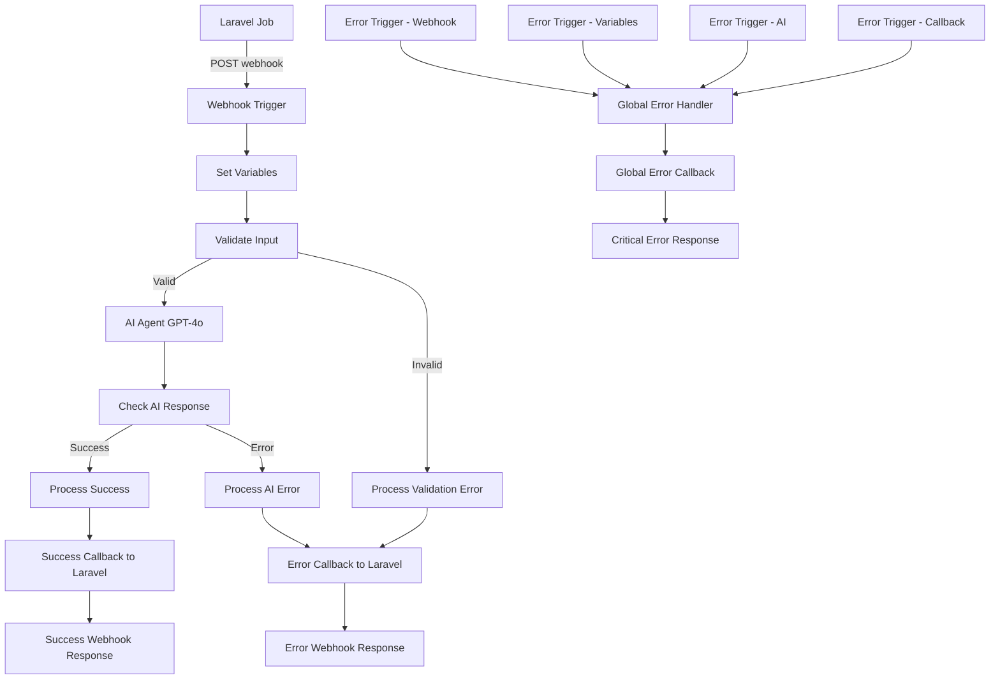

# n8n Workflow Documentation

## Overview

This document provides comprehensive documentation for the **Ad Script Refactor Workflow** implemented in n8n. The workflow processes advertising script refactoring requests from Laravel using AI (GPT-4o) and returns results via webhook callbacks.

## Workflow Information

- **Name**: Ad Script Refactor Workflow
- **ID**: `ad-script-refactor`
- **Version**: 2
- **File**: `workflows/ad-script-refactor-workflow.json`
- **Status**: Active
- **Tags**: Laravel Integration, AI Processing, Error Handling

## Architecture Overview

The workflow implements a robust, production-ready system with comprehensive error handling and monitoring capabilities:



## Workflow Structure

### Core Processing Nodes

1. **Webhook Trigger** (`webhook-trigger`)
   - **Type**: `n8n-nodes-base.webhook`
   - **Path**: `ad-script-refactor-openrouter`
   - **Method**: POST
   - **Authentication**: Header-based (`X-Webhook-Secret`)

2. **Set Variables** (`set-variables`)
   - **Type**: `n8n-nodes-base.set`
   - **Purpose**: Extract and normalize input data
   - **Variables**: `task_id`, `reference_script`, `outcome_description`

3. **Validate Input** (`validate-input`)
   - **Type**: `n8n-nodes-base.if`
   - **Purpose**: Validate required fields presence
   - **Conditions**: `task_id` and `reference_script` not empty

4. **AI Agent (GPT-4o)** (`ai-agent`)
   - **Type**: `@n8n/n8n-nodes-langchain.openAi`
   - **Model**: `gpt-4o`
   - **Temperature**: 0.3
   - **Max Tokens**: 2000
   - **Timeout**: 60 seconds

5. **Check AI Response** (`check-ai-response`)
   - **Type**: `n8n-nodes-base.if`
   - **Purpose**: Validate AI response structure

### Processing Nodes

6. **Process Success** (`process-success`)
   - **Type**: `n8n-nodes-base.code`
   - **Purpose**: Parse AI response and prepare success callback

7. **Process AI Error** (`process-ai-error`)
   - **Type**: `n8n-nodes-base.code`
   - **Purpose**: Handle AI processing failures

8. **Process Validation Error** (`process-validation-error`)
   - **Type**: `n8n-nodes-base.code`
   - **Purpose**: Handle input validation failures

9. **Global Error Handler** (`global-error-handler`)
   - **Type**: `n8n-nodes-base.code`
   - **Purpose**: Handle unexpected workflow errors

### Callback Nodes

10. **Success Callback** (`success-callback`)
    - **Type**: `n8n-nodes-base.httpRequest`
    - **URL**: `{LARAVEL_APP_URL}/api/ad-scripts/{task_id}/result`
    - **Method**: POST
    - **Retry**: 3 attempts, 1s interval

11. **Error Callback** (`error-callback`)
    - **Type**: `n8n-nodes-base.httpRequest`
    - **URL**: Same as success callback
    - **Purpose**: Send error details to Laravel

12. **Global Error Callback** (`global-error-callback`)
    - **Type**: `n8n-nodes-base.httpRequest`
    - **URL**: Same as success callback
    - **Purpose**: Send critical error details

### Response Nodes

13. **Webhook Response Success** (`webhook-response-success`)
    - **Type**: `n8n-nodes-base.respondToWebhook`
    - **Response**: Success confirmation

14. **Webhook Response Error** (`webhook-response-error`)
    - **Type**: `n8n-nodes-base.respondToWebhook`
    - **Response**: Error confirmation

15. **Webhook Response Critical** (`webhook-response-critical`)
    - **Type**: `n8n-nodes-base.respondToWebhook`
    - **Response**: Critical error confirmation

### Error Trigger Nodes

16. **Error Trigger - Webhook** (`error-trigger-webhook`)
17. **Error Trigger - Variables** (`error-trigger-variables`)
18. **Error Trigger - AI** (`error-trigger-ai`)
19. **Error Trigger - Callback** (`error-trigger-callback`)

All error triggers route to the Global Error Handler for consistent error processing.

## Configuration Requirements

### Environment Variables

```bash
# Laravel application URL for callbacks
LARAVEL_APP_URL=http://app:8000

# OpenAI API key for AI processing
OPENAI_API_KEY=your-openai-api-key-here
```

### Required Credentials

1. **OpenAI API** (`openai-credentials`)
   - Type: OpenAI API
   - API Key: Your OpenAI API key

2. **Laravel Webhook Auth** (`webhook-auth`)
   - Type: Header Auth
   - Header Name: `X-Webhook-Secret`
   - Header Value: Webhook secret from `N8N_WEBHOOK_SECRET`

3. **Laravel Callback Auth** (`laravel-callback-auth`)
   - Type: Header Auth
   - Header Name: `X-Webhook-Secret`
   - Header Value: Callback secret from `LARAVEL_CALLBACK_SECRET`

### Workflow Settings

```json
{
  "timezone": "UTC",
  "saveManualExecutions": true,
  "callerPolicy": "workflowsFromSameOwner",
  "errorWorkflow": {
    "enabled": true
  }
}
```

## Input/Output Specifications

### Input Payload

```json
{
  "task_id": "uuid-string",
  "reference_script": "original JavaScript code",
  "outcome_description": "description of desired changes"
}
```

### Success Response

```json
{
  "task_id": "uuid-string",
  "new_script": "refactored JavaScript code",
  "analysis": {
    "improvements": ["list of improvements"],
    "performance_impact": "performance description",
    "maintainability": "maintainability description",
    "potential_issues": ["list of issues"],
    "recommendations": ["list of recommendations"]
  },
  "status": "success"
}
```

### Error Response

```json
{
  "task_id": "uuid-string",
  "error": "error description",
  "status": "error"
}
```

## Version Control and Deployment

### Workflow Export

The workflow is exported and stored in version control as:
- **File**: `n8n/workflows/ad-script-refactor-workflow.json`
- **Format**: n8n JSON export format
- **Version**: Tracked in workflow metadata

### Import Instructions

1. Access n8n instance at `http://localhost:5678`
2. Navigate to **Workflows** → **Import from File**
3. Select `n8n/workflows/ad-script-refactor-workflow.json`
4. Click **Import**
5. Configure required credentials
6. Activate the workflow

### Version Management

- **Workflow Version**: Stored in `versionId` field
- **Git Tracking**: Workflow JSON file is tracked in Git
- **Change Documentation**: Update this document when making changes
- **Backup Strategy**: Regular exports to version control

### Deployment Checklist

- [ ] Import workflow JSON file
- [ ] Configure OpenAI API credentials
- [ ] Configure webhook authentication
- [ ] Configure callback authentication
- [ ] Set environment variables
- [ ] Test webhook endpoint
- [ ] Verify AI processing
- [ ] Test error handling
- [ ] Activate workflow
- [ ] Monitor initial executions

## Testing and Validation

### Automated Testing

Run the comprehensive test suite:

```bash
# Test error handling scenarios
node n8n/test-error-handling.js

# Test AI agent configuration
node n8n/test-ai-agent.js
```

### Manual Testing

Test the webhook endpoint:

```bash
curl -X POST http://localhost:5678/webhook-test/ad-script-refactor-openrouter \
  -H "Content-Type: application/json" \
  -H "X-Webhook-Secret: your-webhook-secret" \
  -d '{
    "task_id": "test-123",
    "reference_script": "function oldFunction() { var x = 1; return x; }",
    "outcome_description": "Modernize to use const/let and arrow functions"
  }'
```

### Integration Testing

Verify end-to-end integration with Laravel:

1. Submit ad script via Laravel API
2. Verify n8n workflow execution
3. Confirm callback received by Laravel
4. Check task status update

## Monitoring and Maintenance

### Key Metrics

- **Execution Success Rate**: Monitor workflow completion rate
- **Error Rates**: Track different error types and frequencies
- **Response Times**: Monitor end-to-end processing time
- **AI Token Usage**: Track OpenAI API consumption
- **Callback Success**: Monitor Laravel callback delivery

### Maintenance Tasks

1. **Regular Exports**: Export workflow after changes
2. **Credential Rotation**: Update API keys and secrets periodically
3. **Performance Monitoring**: Review execution times and optimize
4. **Error Analysis**: Analyze error patterns and improve handling
5. **Documentation Updates**: Keep documentation current with changes

### Troubleshooting

Common issues and solutions:

1. **Webhook Not Receiving Requests**
   - Verify n8n accessibility
   - Check webhook URL configuration
   - Validate authentication headers

2. **AI Processing Failures**
   - Verify OpenAI API key validity
   - Check API quota and rate limits
   - Review prompt format and input

3. **Callback Failures**
   - Ensure Laravel accessibility from n8n
   - Verify callback authentication
   - Check Laravel endpoint logs

## Security Considerations

1. **Authentication**: All communications use header-based authentication
2. **Credential Storage**: Sensitive data stored in n8n credential store
3. **Network Security**: Internal Docker network communication
4. **Input Validation**: Validation on both n8n and Laravel sides
5. **Error Handling**: No sensitive data exposed in error messages

## Related Documentation

- **[Main README](README.md)**: Complete setup and usage guide
- **[Error Handling Guide](ERROR_HANDLING_GUIDE.md)**: Comprehensive error handling documentation
- **[AI Agent Configuration](AI_AGENT_CONFIGURATION.md)**: AI processing setup and optimization
- **Test Scripts**: Automated testing for workflow validation

## Change Log

### Version 2 (Current)
- Enhanced error handling with multiple error triggers
- Improved AI response validation
- Added global error handler
- Comprehensive callback retry logic
- Structured error reporting

### Version 1 (Initial)
- Basic workflow implementation
- Simple error handling
- AI processing with GPT-4o
- Laravel integration

## Support and Contact

For issues or questions regarding the n8n workflow:

1. Check execution logs in n8n interface
2. Review error handling documentation
3. Run automated test scripts
4. Check Laravel application logs
5. Verify configuration and credentials

This workflow is designed for production use with comprehensive error handling, monitoring, and documentation to ensure reliable operation in the Laravel Ad Script Refactor system. 