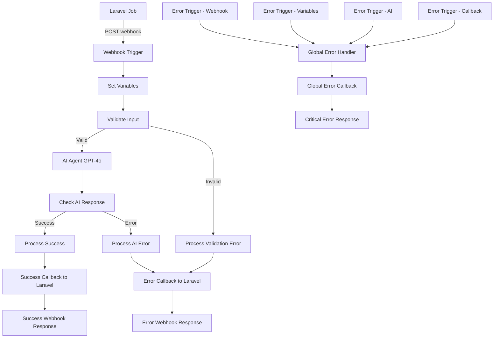

# n8n Ad Script Refactor Workflow

## 📋 Overview

This repository contains a production-ready n8n workflow for processing advertising script refactoring requests using AI (GPT-4o). The workflow integrates seamlessly with Laravel applications and provides comprehensive error handling, monitoring, and validation capabilities.

## 🚀 Quick Start

### Prerequisites

- n8n instance (v1.0+)
- OpenAI API key
- Laravel application with webhook endpoints
- Docker environment (recommended)

### Installation

1. **Import Workflow**:
   ```bash
   # Access n8n interface
   open http://localhost:5678
   
   # Import workflow file
   # Navigate to Workflows → Import from File
   # Select: workflows/ad-script-refactor-workflow.json
   ```

2. **Configure Credentials** (see [Configuration Guide](#-configuration))

3. **Activate Workflow**:
   - Toggle "Active" in the workflow interface
   - Verify webhook URL is accessible

4. **Test Integration**:
   ```bash
   # Run validation
   node validate-workflow.cjs
   
   # Test error handling
   node test-error-handling.js
   
   # Test AI agent
   node test-ai-agent.js
   ```

## 📁 File Structure

```
n8n/
├── workflows/
│   └── ad-script-refactor-workflow.json    # Main workflow export
├── WORKFLOW_README.md                      # This file - main entry point
├── WORKFLOW_DOCUMENTATION.md               # Comprehensive workflow docs
├── WORKFLOW_VERSION_CONTROL.md             # Version control guide
├── README.md                               # Setup and usage guide
├── ERROR_HANDLING_GUIDE.md                 # Error handling documentation
├── AI_AGENT_CONFIGURATION.md               # AI agent configuration
├── validate-workflow.cjs                   # Workflow validation script
├── test-error-handling.js                  # Error handling tests
└── test-ai-agent.js                        # AI agent tests
```

## 🔧 Configuration

### Required Credentials

Configure these in your n8n instance:

1. **OpenAI API** (`openai-credentials`)
   ```
   Type: OpenAI API
   API Key: [Your OpenAI API Key]
   ```

2. **Laravel Webhook Auth** (`webhook-auth`)
   ```
   Type: Header Auth
   Header Name: X-Webhook-Secret
   Header Value: [N8N_WEBHOOK_SECRET value]
   ```

3. **Laravel Callback Auth** (`laravel-callback-auth`)
   ```
   Type: Header Auth
   Header Name: X-Webhook-Secret
   Header Value: [LARAVEL_CALLBACK_SECRET value]
   ```

### Environment Variables

```bash
# Required in n8n environment
LARAVEL_APP_URL=http://app:8000
OPENAI_API_KEY=your-openai-api-key-here
```

## 🏗️ Architecture

The workflow implements a robust processing pipeline:



### Key Features

- ✅ **Comprehensive Error Handling**: Multiple error trigger nodes with global error handler
- ✅ **AI Processing**: GPT-4o integration with structured JSON responses
- ✅ **Retry Logic**: Automatic retries for transient failures
- ✅ **Input Validation**: Robust validation of required fields
- ✅ **Monitoring**: Detailed execution logging and metrics
- ✅ **Security**: Header-based authentication for all communications
- ✅ **Production Ready**: Optimized settings and error workflows

## 📖 Documentation

### Core Documentation

- **[WORKFLOW_DOCUMENTATION.md](WORKFLOW_DOCUMENTATION.md)**: Complete workflow structure, nodes, and configuration
- **[ERROR_HANDLING_GUIDE.md](ERROR_HANDLING_GUIDE.md)**: Comprehensive error handling implementation
- **[AI_AGENT_CONFIGURATION.md](AI_AGENT_CONFIGURATION.md)**: AI processing setup and optimization

### Operational Guides

- **[WORKFLOW_VERSION_CONTROL.md](WORKFLOW_VERSION_CONTROL.md)**: Version control, export/import, and deployment
- **[README.md](README.md)**: Detailed setup and usage instructions

### Testing and Validation

- **[validate-workflow.cjs](validate-workflow.cjs)**: Automated workflow validation
- **[test-error-handling.js](test-error-handling.js)**: Error handling test suite
- **[test-ai-agent.js](test-ai-agent.js)**: AI agent validation tests

## 🧪 Testing

### Automated Validation

```bash
# Validate workflow structure and configuration
node validate-workflow.cjs

# Test error handling scenarios
node test-error-handling.js

# Test AI agent configuration
node test-ai-agent.js
```

### Manual Testing

```bash
# Test webhook endpoint
curl -X POST http://localhost:5678/webhook/ad-script-processing \
  -H "Content-Type: application/json" \
  -H "X-Webhook-Secret: your-webhook-secret" \
  -d '{
    "task_id": "test-123",
    "reference_script": "function oldFunction() { var x = 1; return x; }",
    "outcome_description": "Modernize to use const/let and arrow functions"
  }'
```

### Integration Testing

```bash
# Test full Laravel integration
curl -X POST http://localhost:8000/api/ad-scripts \
  -H "Content-Type: application/json" \
  -H "Accept: application/json" \
  -d '{
    "reference_script": "function test() { var x = 1; return x; }",
    "outcome_description": "Modernize syntax"
  }'
```

## 🔄 Version Control

### Current Version

- **Workflow Version**: 2
- **File**: `workflows/ad-script-refactor-workflow.json`
- **Status**: Production Ready
- **Last Updated**: Current

### Version History

- **v2.0**: Enhanced error handling, global error handler, comprehensive callback system
- **v1.0**: Initial implementation with basic AI processing and Laravel integration

### Making Changes

1. **Export from n8n**: Download updated workflow JSON
2. **Replace File**: Update `workflows/ad-script-refactor-workflow.json`
3. **Validate**: Run `node validate-workflow.cjs`
4. **Test**: Run test suites
5. **Document**: Update relevant documentation
6. **Commit**: Use conventional commit messages

See [WORKFLOW_VERSION_CONTROL.md](WORKFLOW_VERSION_CONTROL.md) for detailed procedures.

## 🚨 Error Handling

The workflow includes comprehensive error handling:

### Error Types

1. **Input Validation Errors**: Missing or invalid required fields
2. **AI Processing Errors**: OpenAI API failures, timeouts, invalid responses
3. **Callback Errors**: Laravel endpoint failures, network issues
4. **Critical Errors**: Unexpected workflow failures

### Error Recovery

- **Retry Logic**: 3 attempts with 1-second intervals for callbacks
- **Global Error Handler**: Catches all unhandled exceptions
- **Error Triggers**: Dedicated error handling for each workflow section
- **Structured Responses**: Consistent error reporting to Laravel

See [ERROR_HANDLING_GUIDE.md](ERROR_HANDLING_GUIDE.md) for complete details.

## 🤖 AI Configuration

### Model Settings

- **Model**: GPT-4o (latest optimized version)
- **Temperature**: 0.3 (consistent, focused responses)
- **Max Tokens**: 2000 (sufficient for detailed analysis)
- **Timeout**: 60 seconds

### Response Format

The AI returns structured JSON with:
- `new_script`: Refactored JavaScript code
- `analysis`: Detailed analysis object with improvements, performance impact, etc.

See [AI_AGENT_CONFIGURATION.md](AI_AGENT_CONFIGURATION.md) for complete configuration details.

## 📊 Monitoring

### Key Metrics

- **Execution Success Rate**: Monitor workflow completion rate
- **Error Rates**: Track different error types and frequencies
- **Response Times**: Monitor end-to-end processing time
- **AI Token Usage**: Track OpenAI API consumption
- **Callback Success**: Monitor Laravel callback delivery

### Monitoring Tools

- **n8n Execution Logs**: Built-in execution monitoring
- **Workflow Settings**: Error workflow enabled for additional tracking
- **Test Scripts**: Automated validation and testing

## 🔒 Security

### Authentication

- **Webhook Authentication**: Header-based authentication for incoming requests
- **Callback Authentication**: Secure authentication for Laravel callbacks
- **Credential Management**: Secure storage in n8n credential store

### Best Practices

- Regular credential rotation
- Environment variable usage for sensitive data
- Input validation on both n8n and Laravel sides
- No sensitive data in error messages

## 🚀 Deployment

### Pre-Deployment Checklist

- [ ] Workflow validated with `validate-workflow.cjs`
- [ ] All tests passing
- [ ] Credentials configured
- [ ] Environment variables set
- [ ] Documentation updated

### Deployment Steps

1. Import workflow to production n8n
2. Configure credentials and environment variables
3. Run validation and tests
4. Activate workflow
5. Monitor initial executions

### Post-Deployment

- Monitor error rates and execution success
- Verify callback delivery to Laravel
- Check AI processing performance
- Review execution logs

## 🆘 Troubleshooting

### Common Issues

1. **Webhook Not Receiving Requests**
   - Check n8n accessibility and webhook URL
   - Verify authentication headers
   - Review network configuration

2. **AI Processing Failures**
   - Verify OpenAI API key and quota
   - Check model availability and rate limits
   - Review prompt format and input validation

3. **Callback Failures**
   - Ensure Laravel accessibility from n8n
   - Verify callback authentication credentials
   - Check Laravel endpoint logs and responses

### Debug Steps

1. Check n8n execution logs for detailed error information
2. Run validation script to verify workflow configuration
3. Test individual components with provided test scripts
4. Monitor Laravel logs for callback processing
5. Verify network connectivity between services

## 📞 Support

### Getting Help

1. **Documentation**: Review relevant documentation files
2. **Validation**: Run `node validate-workflow.cjs` to check configuration
3. **Testing**: Use provided test scripts to isolate issues
4. **Logs**: Check n8n execution logs and Laravel application logs

### Contributing

1. Follow version control procedures in [WORKFLOW_VERSION_CONTROL.md](WORKFLOW_VERSION_CONTROL.md)
2. Update documentation when making changes
3. Run all tests before submitting changes
4. Use conventional commit messages

## 📄 License

This workflow is part of the Laravel n8n Ad Refactor project. See the main project repository for license information.

---

**🎯 Ready to get started?** Follow the [Quick Start](#-quick-start) guide above, then dive into the detailed documentation for your specific needs. 